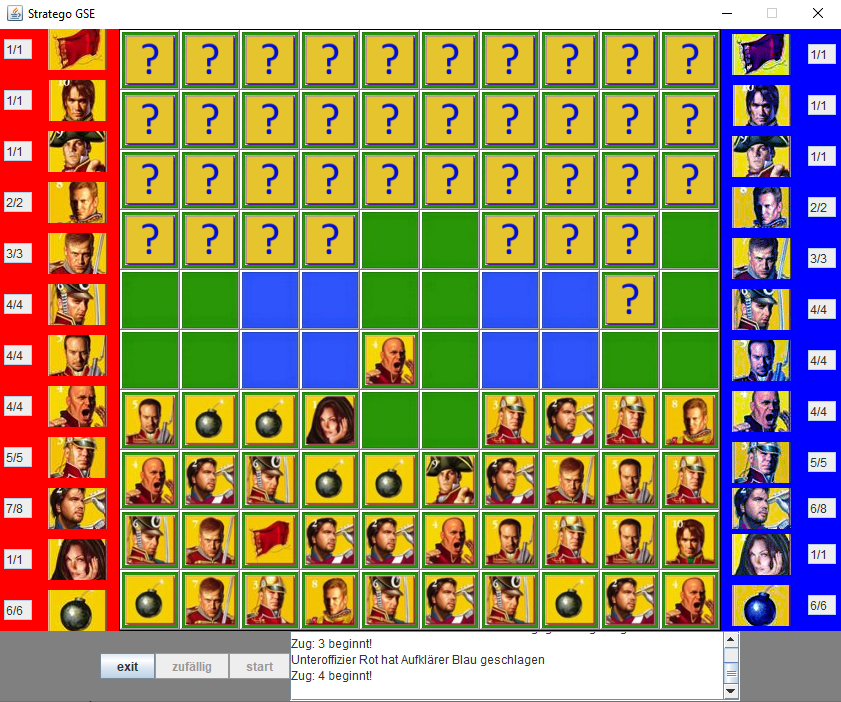

# Stratego

<h3>How to run the code</h3>

Clone the repository to a directory on your machine

Execute the main from Spiel.java 

The application should now be running

<h3>What I have learned</h3>
<ul>

<li>Java</li>
<li>Working with Java Swing</li>
<li>Object oriented programming</li>
<li>Implementing a boardgame from scratch</li>

</ul>

<h3>Description</h3>

This project was created on the initiative of a colleague and myself. In a lecture we illustrated Stratego from the game manual in various UML diagrams. 
By our own initiative we converted these diagrams into a real Java program.

